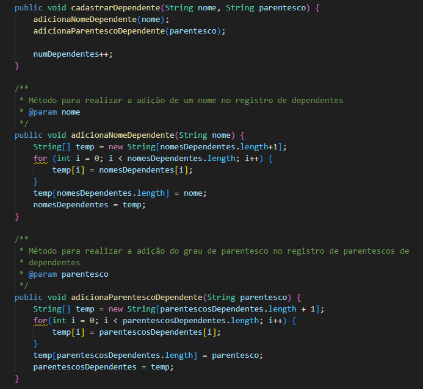
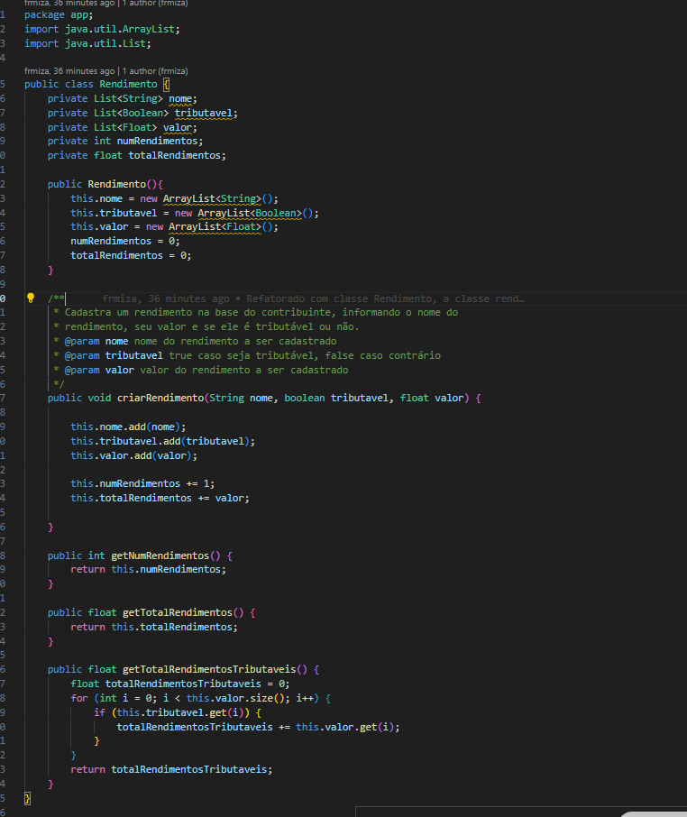
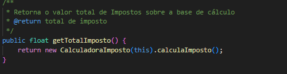
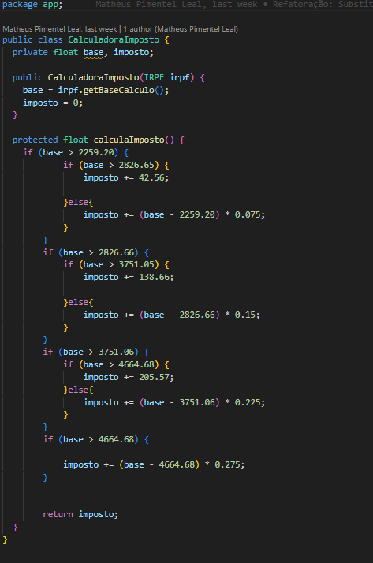

# TRABALHO_TPPE

### Grupo 20:
Matheus Pimentel
Mizael Santos
Diógenes Júnior
Felipe Moura

#### Correções feitas entre o TP1 e o TP2

Foram aplicadas as correções apentadas pelo professor no arquivo disponibilizado pelo professor no arquivo correcaoTP1.md

- TesteBaseCalculo.java: Triangulação, parametrização e correção dos testes.
- TesteAliquotaEfetiva.java: Triangulação, parametrização e correção dos testes.
- TesteTotalFaixasImposto.java: Triangulação, parametrização e adição dos testes.

As correções foram feitas de forma a melhorar as próximas entregas.

## TP2

Para o TP2, como pedido no enunciado, foi feito:

1. Extração de método da função IRPF.cadastrarDependente(), gerando o método IRPF.adicionaNomeDependente() e adicionaParentescoDependente(), separando o original.

*Figura 1: Extrair Método*

2. Extração Classe IRPF, gerando a nova Classe Rendimento.java. Commit com a justificativa: https://github.com/felipecdmoura/TRABALHO_TPPE/commit/481d15a2f738912be842ac396a921313e7b6aa6f.

*Figura 2: Extrair Classe*

3. Substituição da classe IRPF.getTotalImposto() por objeto método, no arquivo CalculadoraImposto.java.

 
*Figura 3: Novo getTotalImposto*

*Figura 4: Classe CalculadoraImposto*